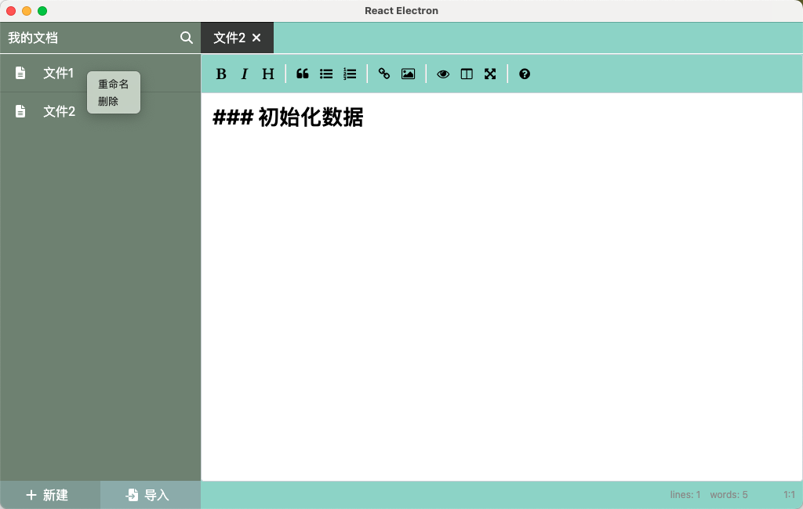

# React + Electron

### 业务:



1. 支持新建、导入本地文件

2. md文件查看、编辑

3. 保存、未保存状态

4. 各类键盘快捷键操作：新建、导入、保存、搜索、复制、粘贴。。。

5. 键盘事件监听处理

6. 主进程和渲染进程通信

7. 自定义菜单：重命名、删除

8. dialog窗口选择文件，弹框提示

   

### 三方库
```
electron-is-dev: 判定环境
concurrently: 链接多个命令, 中间使用空格隔开
wait-on: 等待某个结果执行之后再去执行后续的命令
cross-env: 跨平台的环境变量设置

bootstrap: UI组件库
style-components: 自定义样式
classnames
react-simplemde-editor: markdown编辑器
electron-store: 本地持久化

https://fontawesome.com/icons: 图标库
@fortawesome/fontawesome-svg-core: 核心文件需要安装
@fortawesome/react-fontawesome: react 风格
@fortawesome/free-solid-svg-icons: solid 类型字体库
prop-types: 类型校验
```


### 运行

1. 先安装依赖`yarn `
2. 执行`yarn dev`
